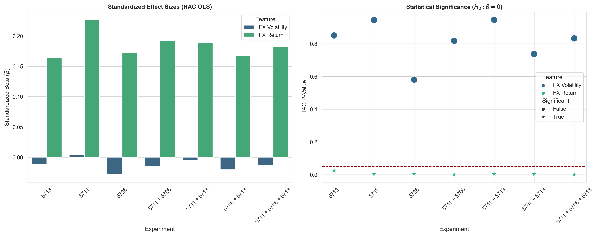
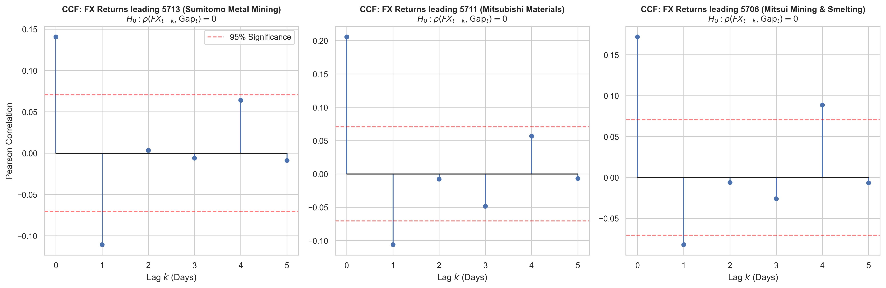
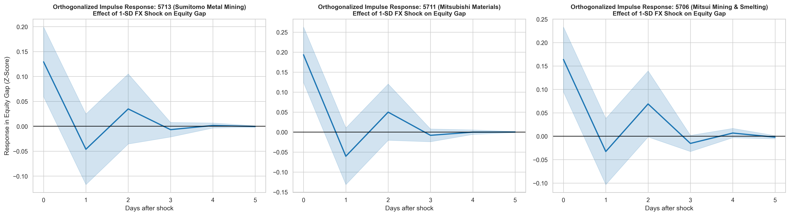

# Overnight FX Information Transfer at the Tokyo Open

*A microstructure-consistent study of USD/JPY and Japanese non-ferrous mining equities*

Isaiah Choi, Ken Hayashi, Taiki Takahashi — Dartmouth College, Winter 2026.

---

## TL;DR

Overnight USD/JPY returns carry statistically significant information about the next-morning opening gap of three Japanese non-ferrous mining firms (Sumitomo Metal Mining, Mitsubishi Materials, Mitsui Mining & Smelting). The effect is tightly bounded to the opening auction itself — Granger causality fails at every lag beyond the contemporaneous day, out-of-sample magnitude prediction is worse than a naive zero forecast across all configurations, and directional accuracy is only meaningfully above chance in one of seven experimental settings. The contribution is not a tradable strategy; it is a rigorous characterization of an information-friction effect at the boundary between a 24-hour market and a discrete batch auction.

## Headline findings

Across seven experimental configurations (three single-stock models plus four multi-stock baskets), the standardized HAC OLS coefficient on overnight FX return ranges from **0.164 to 0.227**, with Newey-West corrected p-values between **0.0009 and 0.0248**. Every coefficient is positive, every p-value is below 0.05, and the effect holds whether the sample is a single firm or a three-firm panel.

FX volatility, by contrast, is statistically insignificant in all linear specifications (p-values from 0.58 to 0.94), yet ranks as the second-most-important feature in the Random Forest models (MDI ≈ 0.20). This linear/non-linear dichotomy suggests volatility operates as a conditioning variable on the transmission of directional FX signals into equity gaps, not as a direct driver of gap magnitude.

Out-of-sample performance is notably weak. OOS R² is negative across every experiment (-0.065 to -0.178), mutual information peaks at 0.10, and the Diebold-Mariano test fails to reject the naive zero-forecast benchmark in most configurations. Directional accuracy is 49.7%, 60.1%, and 49.0% for 5713, 5711, and 5706 respectively; multi-stock baskets range 49.7% to 53.3%. The 60.1% result on Mitsubishi Materials is one outlier among seven configurations; the other six cluster near a coin flip.

## Figures

The paper's headline econometric evidence — standardized HAC OLS betas and Newey-West-corrected p-values across all seven experimental configurations.



The temporal structure of the FX-to-gap relationship, shown via cross-correlation functions. The lag-0 peaks (0.14 to 0.21 across tickers) establish the contemporaneous effect; the sign reversal at lag 1 and the immediate decay into the 95% confidence band is consistent with rapid absorption of FX information at the opening auction.



The impulse response functions reinforce the bounded-effect interpretation: a significant step-zero response, a directional reversal at step one, and decay toward zero within three to four trading days.



Three additional figures — Granger causality p-value heatmap (`3_Granger_Causality_All.png`), rolling expanding-window out-of-sample R² (`5_Rolling_R2_All.png`), and Random Forest feature importance (`6_Feature_Importance.png`) — are in `results/figures/`. See `docs/methodology.md` for their interpretation.

## What this paper is and isn't

**This paper is** a rigorous characterization of an information-friction effect between continuously-traded USD/JPY and the discrete Tokyo Stock Exchange opening auction for USD-exposed Japanese mining equities. The identification strategy — a strict timestamp-level lookahead guard that excludes any FX data at or after the 09:00 JST opening auction — establishes that the observed contemporaneous relationship cannot be an artifact of bidirectional intraday price discovery. The methodological contribution is the combination of that identification, a seven-configuration cross-validation, and a multi-layer econometric framework (HAC OLS, cross-correlation, Granger causality, VAR-based impulse response, rolling OOS R²) that characterizes the boundedness of the effect rather than claiming its exploitability.

**This paper is not** a backtest of a profitable trading strategy. The Granger null at every lag beyond the contemporaneous day, combined with the sign reversal in the impulse response function at step 1 and the uniformly negative OOS R² values, establishes that the information is absorbed within the opening auction and does not persist into exploitable intraday or multi-day signals. Translating this finding into a strategy would require intraday execution data the present dataset does not include, and would likely demand the quanto derivative structures discussed in Section 7 of the paper as a way to isolate the equity repricing signal from spot FX exposure.

## Repository structure

```
fx-gap-jp-equities/
├── README.md                  (this file)
├── LICENSE                    (MIT)
├── requirements.txt
├── pyproject.toml
├── PLAN.md                    (project execution plan — archival)
├── CODE_REVIEW_NOTES.md       (known issues and decisions — archival)
├── CITATION_CHECKLIST.md      (manual verification checklist)
├── HANDOFF.md                 (pre-publish checklist)
├── paper/
│   └── Choi_Hayashi_Takahashi_2026.pdf
├── src/
│   ├── config.py              (ResearchConfig dataclass)
│   ├── data_engine.py         (FX/equity loading + lookahead guard)
│   ├── features.py            (panel assembly + chronological split)
│   ├── models.py              (HAC OLS + Random Forest wrappers)
│   ├── econometrics.py        (CCF, Granger, VAR/IRF, rolling R², DM)
│   ├── evaluation.py          (experiment orchestration)
│   ├── plotting.py            (six paper figures)
│   └── main.py                (CLI entry point)
├── scripts/
│   └── reproduce_paper.py     (convenience wrapper for main.py)
├── tests/
│   ├── test_lookahead_guard.py
│   ├── test_feature_construction.py
│   └── test_data_engine.py
├── data/
│   └── README.md              (data schema; real data not committed)
├── docs/
│   ├── methodology.md         (plain-English technical writeup)
│   ├── limitations.md         (explicit caveat enumeration)
│   ├── interpretation.md      (how to read the results honestly)
│   └── website_summary.md     (portfolio-page writeup)
└── results/
    ├── figures/               (PNG/PDF outputs of paper figures)
    └── tables/                (CSV output of Table 1)
```

## Reproduction

### Prerequisites

- Python 3.10 or later
- The seven packages listed in `requirements.txt`
- Access to Bloomberg Terminal (or equivalent) for the underlying data

### Data setup

The data used in the paper is sourced from Bloomberg Terminal and cannot be redistributed. To reproduce the paper's numerical results, obtain the following and place the files in `data/`:

1. `USDJPY.csv` — 5-minute bars of USD/JPY spot, January 2023 through the analysis date, with columns `Dates`, `Open`, `Close`, `High`, `Low`.
2. `JPEquities.xlsx` — one sheet per ticker (5706, 5711, 5713), each with Bloomberg-style daily OHLC (`Dates`, `PX_OPEN`, `PX_LAST`).

See `data/README.md` for the exact schema the code expects, including Bloomberg export conventions.

### Run

```bash
git clone <repo-url>
cd fx-gap-jp-equities
pip install -r requirements.txt
# Place USDJPY.csv and JPEquities.xlsx in data/
python -m src.main reproduce-paper
```

Results land in `results/figures/` (six paper figures) and `results/tables/table1_results.csv`.

### Command-line interface

```bash
# Full reproduction: table plus all six figures.
python -m src.main reproduce-paper

# Skip figures (faster iteration during development).
python -m src.main reproduce-paper --no-figures

# Override the data directory without modifying config.
python -m src.main --data-dir /path/to/data reproduce-paper

# Or via environment variable.
FX_GAP_DATA_DIR=/path/to/data python -m src.main reproduce-paper
```

## Tests

```bash
pip install pytest
pytest tests/
```

Three test suites verify: (1) the timestamp-level lookahead guard correctly rejects any FX bar at or after 09:00 JST, (2) feature construction produces the expected columns with expected dtypes, and (3) the synthetic data generator emits a schema matching the code's expectations.

## Authors

Isaiah Choi, Ken Hayashi, Taiki Takahashi. Dartmouth College, Mathematics 86 (Mathematical Finance), Winter 2026. Faculty instructor: Professor John Welborn.

Corresponding author: Isaiah Choi, isaiah.j.choi.27@dartmouth.edu.

## AI disclosure

This project used AI tools throughout, including for code authorship assistance on portions of the machine learning pipeline, literature discovery, and prose drafting. The authors designed the research question, constructed the data pipeline's identification strategy (including the lookahead guard), selected the econometric framework, interpreted results, and bear responsibility for all claims in the paper. Citations were verified manually against primary sources.

## License

MIT. See `LICENSE`.

## Citation

```bibtex
@techreport{choi_hayashi_takahashi_2026,
  author = {Choi, Isaiah and Hayashi, Ken and Takahashi, Taiki},
  title  = {Lead-Lag FX Gap Trading in Japanese Equities},
  institution = {Dartmouth College, Department of Mathematics},
  year   = {2026},
  type   = {Mathematics 86 Final Project},
  note   = {Winter 2026}
}
```
